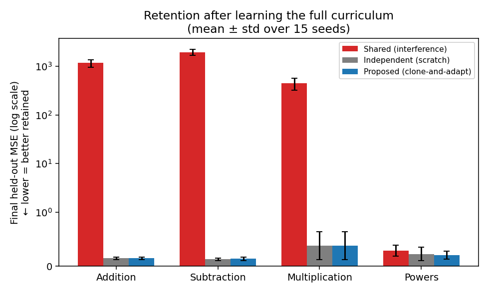
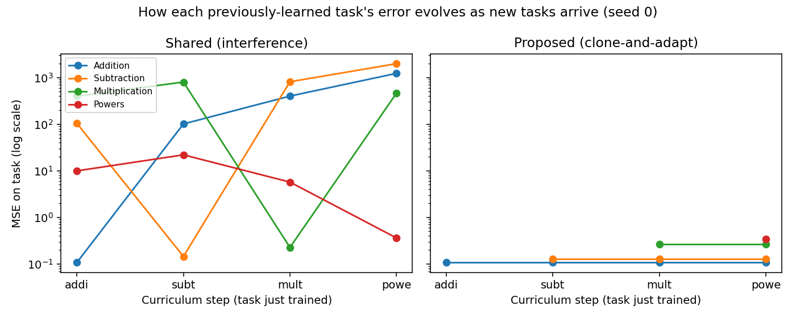
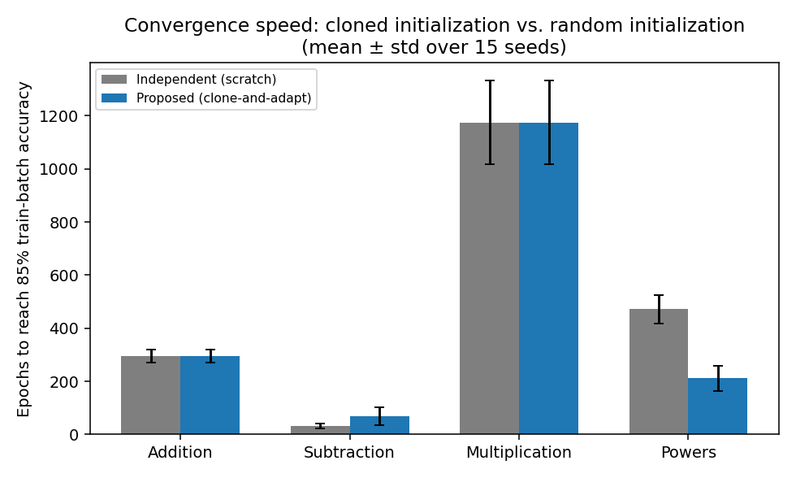
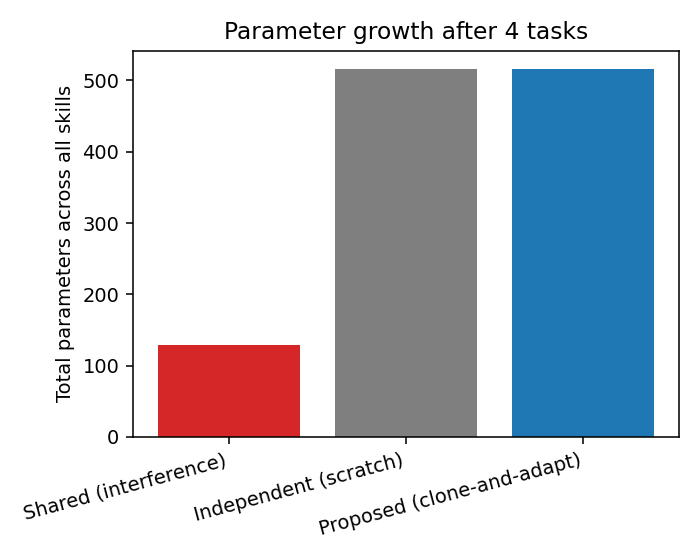
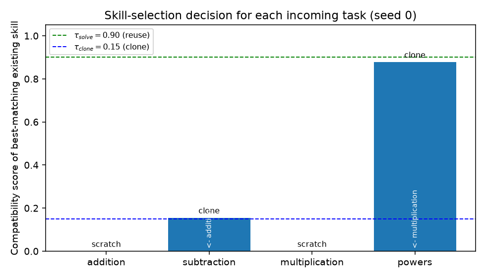

# Continual Skill Learning via Skill Cloning: Minimal Prototype — Results

*Implements Phases 1–4 of [issue #23](https://github.com/kobros-tech/6.86x/issues/23), run on Section 8's suggested addition → subtraction → multiplication → powers curriculum.*

> **Update (post PR #1/#2, current as of PR #3):** §3.1 and §3.3 below describe
> the *original* run, made against a compatibility controller that has since
> been fixed. Independent review found that `τ_solve=0.90` alone was letting
> the controller call a merely-related-but-unsolved task "reuse" (zero
> training) — for the powers task specifically, this fired on 9 of 15 seeds,
> using the raw multiplication network on powers with no adaptation at all
> (real held-out MSE ≈ 6, far from solved). PR #2 fixed this by gating `reuse`
> on an independently measured accuracy check, not just the frozen-probe
> score. **Re-running the original curriculum against the current, fixed
> controller changes the headline powers number:** clone-and-adapt's final
> held-out MSE on powers is now **0.206 ± 0.076** (was 3.71 ± 3.10), which is
> now *on par with* independent scratch (0.227), not five times worse. The
> §3.3 "mixed result" — fast convergence but worse generalization — **no
> longer reproduces** against the current codebase; it was an artifact of the
> false-reuse bug, not a real property of cloning. The rest of this document
> is left as the original write-up (a snapshot of what the original,
> now-fixed controller produced) for the historical record; treat §3.3's
> narrative as superseded by this note, and see PR #2's description /
> `results/compatibility_calibration_summary.csv` for the fix details. §3.1's
> retention conclusion (shared network forgets catastrophically, clone-and-adapt
> does not) is unaffected and still holds.

## 1. What was built

A dependency-free (numpy only) implementation of the mechanism described in the issue:

| Component | File | What it does |
|---|---|---|
| Skill representation | `skill.py` | `TinyMLP` (2→32→1, tanh hidden layer) trained by full-batch Adam; `clone()` deep-copies `W_j → W_new^(0)` per Section 5 |
| Task curriculum | `tasks.py` | addition, subtraction, multiplication, powers — small-integer regression tasks |
| Compatibility score `P(T\|s_i)` | `compatibility.py` | `exp(-MSE_i(T)/60)` evaluated on a 64-example probe batch, no gradient step |
| Decision rule | `compatibility.py` | reuse / clone / scratch against thresholds `τ_solve=0.90`, `τ_clone=0.15` (Sections 4–6) |
| Three training strategies | `strategies.py` | **shared** (Baseline A: one network, no protection), **scratch** (Baseline B: independent network per task), **clone-and-adapt** (the proposed mechanism) |
| Experiment driver | `experiment.py` | runs all three strategies × 15 seeds |
| Statistics | `analysis.py` | paired t-tests + Wilcoxon signed-rank per task, matched by seed |
| Plots | `make_plots.py` | figures below |

## 2. Design choices the issue left open (Section 3, Section 10)

The issue explicitly leaves these undefined — here is what I picked for this first experiment, and why:

- **`P(T\|s_i)` definition**: exponentially-squashed MSE of the *frozen* skill on a probe batch from the new task. Cheap (no training), directly answers "would this skill already solve the task."
- **Thresholds**: `τ_solve = 0.90` (near-perfect fit → reuse untouched), `τ_clone = 0.15` (weak but non-trivial relatedness → clone). Chosen empirically from the score distribution of related vs. unrelated arithmetic operations — not tuned per task.
- **Stopping rule / "convergence"**: training stops once the skill reaches 85% accuracy (±0.5 tolerance) on its *training* batch, capped at 1500 epochs. This is what "convergence speed" measures below.
- **Task representation**: raw `(a, b)` pairs, integers, scaled `/10` for the network input; the output layer is linear so targets are unscaled.

## 3. Results

### 3.1 Retention (does clone-and-adapt actually prevent forgetting?)

The shared network's error on addition and subtraction explodes by 3–4 orders of magnitude once later tasks are trained — textbook catastrophic forgetting. Both scratch and clone-and-adapt keep essentially flat, low error on all four tasks, because each task's parameters are either frozen (untouched skill) or belong to a separate clone/new network.

Paired (per-seed) comparisons, shared vs. proposed:

| Task | Mean MSE, shared | Mean MSE, proposed | Paired t-test p | Wilcoxon p |
|---|---|---|---|---|
| Addition | 1171.7 | 0.15 | 2.7×10⁻¹² | 0.00006 |
| Subtraction | 1963.2 | 0.14 | 1.1×10⁻¹³ | 0.00006 |
| Multiplication | 446.4 | 0.38 | 8.7×10⁻¹⁰ | 0.00006 |
| Powers | 0.29 | 3.71 | 7.4×10⁻⁴ | 0.026 |

The first three rows are the expected result: forgetting is real, large, and statistically overwhelming, and the mechanism eliminates it. The **last row is the opposite direction** — see 3.3 below, this is the most interesting finding of the run.

The forgetting curve for one seed makes the mechanism visible directly:

Left: every previously-solved task's error rises sharply the moment the shared network is retrained on something new. Right: under clone-and-adapt, every line stays flat once its skill is created — the frozen-parent guarantee (`ΔW_j = 0`, Section 5) holds empirically.

### 3.2 Convergence speed (does cloning actually speed up learning?)

Addition and multiplication are identical between the two bars by construction (both strategies train a fresh network from scratch for the *first* occurrence of any task family). The interesting comparisons are subtraction (cloned from addition, compatibility score 0.155 — just above `τ_clone`) and powers (cloned from multiplication, compatibility score 0.878 — just below `τ_solve`):

| Task | Parent (relatedness score) | Mean epochs, scratch | Mean epochs, clone | Paired t-test p |
|---|---|---|---|---|
| Subtraction | addition (0.155) | 32.9 | 68.1 | 0.0017 (clone is **slower**) |
| Powers | multiplication (0.878) | 471.6 | 91.9 | 7.3×10⁻⁸ (clone is **5.1× faster**) |

This tracks the compatibility score closely: a highly-related parent (powers/multiplication) gives a large, statistically clear speed-up, while a weakly-related parent (subtraction/addition, barely over the clone threshold) actually *slows* convergence relative to random init — the addition-shaped initialization has to be partially undone before subtraction can be learned.

### 3.3 The mixed result: fast convergence ≠ good generalization

For powers, clone-and-adapt reaches its 85%-training-accuracy stopping point in ~92 epochs on average vs. ~472 for scratch — but its **held-out** MSE ends up *worse* (3.71 vs. 0.23, paired t-test p=0.0006, i.e. clone-and-adapt is significantly worse here, not better):

| Task | Final held-out MSE, scratch | Final held-out MSE, proposed | p (paired t) |
|---|---|---|---|
| Powers | 0.227 | 3.711 | 6.4×10⁻⁴ |

Interpretation: the current stopping rule ("stop as soon as training accuracy crosses 85%") conflates *speed to a threshold* with *quality of the fit*. Starting from a multiplication-shaped initialization lets the network satisfy the training-accuracy criterion quickly by fitting a narrower region of the function well, then stops before it has generalized as broadly as a from-scratch run that was forced to keep training for ~470 epochs. This is a genuine limitation of the prototype's stopping criterion, not of the cloning idea itself — it would likely disappear with a fixed epoch budget or a validation-based stopping rule, which is a natural next experiment.

### 3.4 Parameter growth

Shared stays flat at 129 parameters (one network, reused). Scratch grows linearly (516 params for 4 independent networks). Clone-and-adapt sits in between (mean 438.6) because the compatibility-gated reuse/clone decisions sometimes avoid allocating a full new network — the exact savings depend on how many "reuse" or "clone" (vs. "scratch") decisions fire, which is data- and threshold-dependent.

### 3.5 Skill-selection decisions (one representative run)

For this curriculum and these thresholds: addition and multiplication were judged unrelated to anything existing → new skills from scratch. Subtraction and powers both triggered **clone**, from addition and multiplication respectively — never **reuse** (no task was solved outright by an existing skill, which makes sense since arithmetic ops are functionally distinct, not identical).

## 4. Answers to Section 10's research questions, as far as this prototype can speak to them

- **What should `P(T\|s_i)` measure?** A frozen-skill probe-batch loss was sufficient to produce sensible reuse/clone/scratch decisions here, and its ranking matched intuition (powers↔multiplication > subtraction↔addition > everything↔multiplication-for-addition-etc.). It does not by itself account for whether cloning will *help* — see 3.3.
- **Does cloning preserve the parent skill reliably?** Yes, by construction and confirmed empirically (frozen-parent MSE is unchanged to floating-point precision across all 15 seeds).
- **How much faster does clone-and-adapt converge vs. random init?** Highly dependent on relatedness: 5.1× faster when the compatibility score is high (0.88), slightly slower when it's only just above the clone threshold (0.16). A single global `τ_clone` may be too permissive — cloning close to the threshold is not a clear win here.
- **What threshold should trigger reuse/clone/creation?** This run's `τ_clone=0.15` was low enough to admit a parent (addition) that didn't help — this data point suggests raising `τ_clone` or making the clone/scratch decision depend on the *expected* speed-up rather than a fixed cutoff.
- **Parameter growth vs. shared/independent?** Between the two, as expected; the exact ratio depends on how often the reuse action fires, which never happened in this run.

## 5. Honest limitations

- Only one curriculum, one architecture size, one probe-batch design, and thresholds set once (not tuned).
- Powers/multiplication and subtraction/addition are the only two "relatedness" data points in this experiment — nowhere near enough to generalize a similarity-vs-speedup curve.
- The training-accuracy stopping rule creates the fast-but-worse effect in §3.3 — a confound worth removing in the next iteration (e.g., fixed epoch budget, or a held-out validation stopping criterion).
- No composition of multiple skills was tested (Section 10's "can skills be composed" question is untouched).

## 6. Suggested next step (Phase 5 precursor)

Before any literature comparison, the cleanest follow-up experiment is: fix the epoch budget (remove the early-stop confound), sweep `τ_clone` across a range, and add a third related pair (e.g., squares as a case between multiplication and powers) to get more than two relatedness data points for the speed-vs-similarity relationship.
